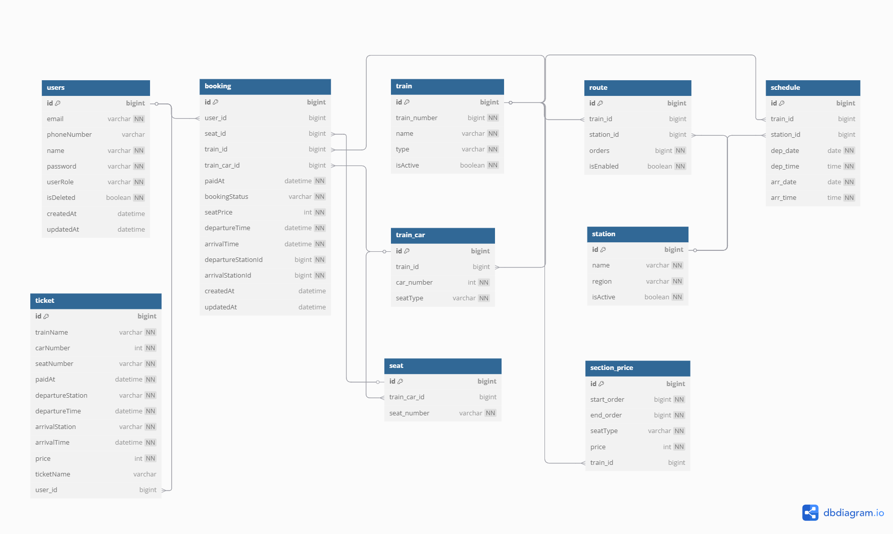

# 🚂 오락실행

Spring Boot 기반 **실시간 기차 예매 서비스**를 제공하는 백엔드 서버입니다.

<br>

## 🪜 프로젝트 개요
- 기간 : 2025.05.16 ~ 2025.05.23
- 인원 : 5인 개발 (팀 프로젝트)
- 목표
  - 사용자는 기차, 날짜, 시간, 좌석을 선택해 실시간 예매할 수 있으며, 예매 후 예매 내역과 티켓을 조회할 수 있습니다.
  - 다수의 사용자 접속 환경을 고려하여 요청 순서를 제어하는 **대기열 시스템**을 도입했습니다.
  - **Redisson 분산 락 기반 동시성 제어**를 통해 하나의 좌석에는 단 한 명만 예매할 수 있도록 구현했습니다.
  - CI/CD 파이프라인을 구축하여 EC2 환경에서 **자동 배포**가 가능하도록 설정했습니다.

<br>

## 🛠 기술 스택

- Backend : Java 17, Spring Boot 3.4.5, Spring Security, JWT
- Database : MySQL, Redis (Spring Data Redis, Redisson)
- ORM : Spring Data JPA, Hibernate, QueryDSL 5.0.0 (Jakarta)
- Authentication & Security : JWT 기반 인증, Bcrypt 비밀번호 암호화
- Test : JUnit5, Spring Boot Test, Spring Security Test
- DevOps : AWS EC2 (Linux), Docker, GitHub Actions (CI/CD)
- API TEST : Postman
- 기타 : Lombok, Validation

<br>

## 📊 ERD


<br>

## 📂 프로젝트 구조

```bash
team.project.fiverockrun
├── common
│   ├── config
│   ├── entity
│   ├── exception
│   └── redis
│
└── domain
    ├── auth
    ├── booking
    ├── price
    ├── reservation
    ├── route
    ├── schedule
    ├── station
    ├── ticket
    ├── train
    ├── user
    └── waitLine  

```

<br>

## 🧾 [API 명세서](https://www.notion.so/1fef1ccea86a80d88ce2e6be3cc13a13?v=1fef1ccea86a8065bc13000cf68dfe02&pvs=4)

<br>

## ⚙️ 주요 기능

### 사용자 [@SaltBr](https://github.com/SaltBr)

* JWT와 Spring Security를 활용한 회원가입, 로그인, 회원 탈퇴
* Redis를 활용한 로그아웃 기능
* 마이페이지 정보 조회 및 수정

### 열차 운영 [@dawn0920](https://github.com/dawn0920)

* 역, 노선, 열차, 차량, 좌석, 열차 스케줄 등록 및 관리
* 열차 및 노선 활성화 / 비활성화 설정
* 차량 및 좌석 구성 변경

### 가격 정책 [@withong](https://github.com/withong)

* 좌석 등급별 가격 등록, 수정, 삭제
* 프리미엄/일반 등급별 가격 목록 및 단건 조회

### 열차 검색 [@dawn0920](https://github.com/dawn0920)

* 출발역, 도착역, 날짜, 출발 시간 기준으로 열차 목록 조회
* 노선 순서와 스케줄 정보 기반으로 예약 가능한 열차 필터링

### 대기열 시스템 [@exmrim](https://github.com/exmrim)

* 사용자 대기열 입장 및 순번 부여
* 순번 실시간 조회, 수동 이탈, 예약 완료 시 자동 이탈 처리
* 예매 진입 흐름 제어를 통한 서버 안정성 확보

### 예약 (결제 대기) [@withong](https://github.com/withong)

* Redis에 좌석 예약 정보 저장
* Redisson 분산 락 적용을 통한 동시성 제어
* 사용자 예약 목록 조회, 좌석별 예약 정보 조회, 단건 조회 및 취소
* SCAN 명령어 기반 예약 목록 조회 최적화

### 예매 (결제 완료) [@gonaeun](https://github.com/gonaeun)

* 예매 정보 저장, 취소 및 티켓 발급
* 사용자 예매 목록 조회 및 단건 조회

### 배포 및 CI/CD [@gonaeun](https://github.com/gonaeun)

* Docker Compose로 Spring Boot, MySQL, Redis 통합 실행 환경 구성
* .env와 docker 프로파일을 활용한 환경 분리
* GitHub Actions로 빌드 및 테스트 자동화 설정
